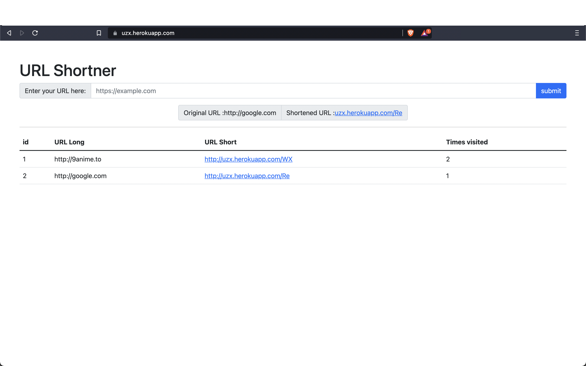

# url-shortener-elitmus

This is a simple flask app which takes an URL and shortens it. This shortened verion of the URL redirects to the user to the long URL. 

For each long URL given by the user the application randomly generates an alphabetical combination which redirects to the long URL which is 20 characters long entirely.

# Webiste hosted on heroku
hosted site link : https://uzx.herokuapp.com/

# Salient Features
 - All the shortened links and the original link are available in a table along with the number of times a shortened link has been visited.
 - The total length of the shortened url is 20 characters long (excluding https://)

# Setting Up in local 

### Clone the repository 

`
git clone https://github.com/shriramrahul7/url-shortner-elitmus.git
`

Change directory

`
cd url-shortner-elitmus
`

Setup the local environment using the requirements.txt file

`
pip install -r requirements.txt
`

then, just ensure that you have your sqlite running

and now to execute the app

`
python3 app.py
`